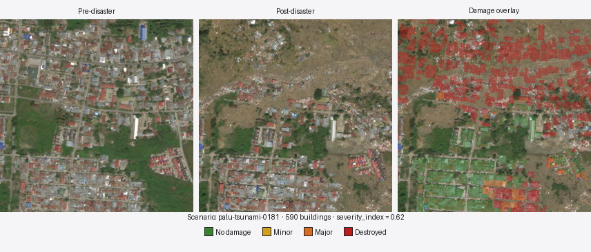
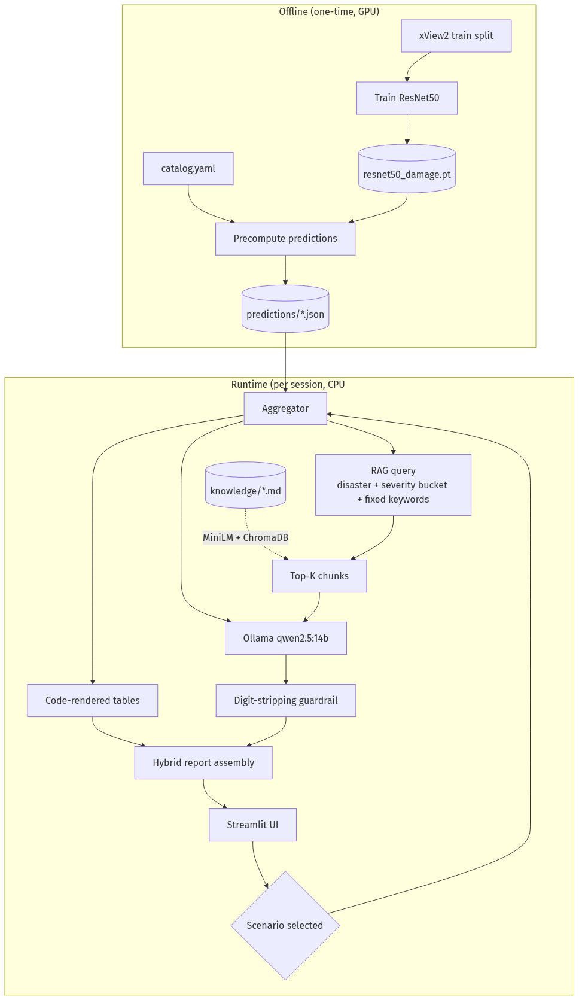
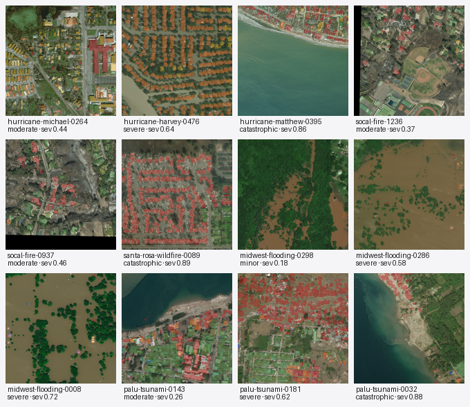

<p align="center">
  
</p>

<h1 align="center">EO Damage Intelligence Assistant</h1>

<p align="center">
  Turn satellite damage predictions into grounded, structured disaster-assessment reports.<br>
  Single-workstation prototype: ResNet50 + RAG + a local LLM, end-to-end in a browser.
</p>

<p align="center">
  
  
  
  
  
  
</p>

---

## What this is

- An **end-to-end pipeline** that turns precomputed per-building damage predictions from xView2 satellite imagery into structured **five-section disaster reports** (Situational Overview, Damage Breakdown, Priority Zones, Uncertainty & Caveats, Recommended Actions).
- **Hybrid grounding**: numeric content (counts, percentages, per-quadrant priority) is rendered by code and inserted verbatim; narrative content is written by a local LLM constrained by retrieved knowledge documents and a post-generation digit-stripping guardrail.
- **Runs locally** on a single workstation. No cloud calls at runtime. The CV classifier touches the GPU only during one-time training and precompute; at user-facing runtime the GPU is owned by Ollama.

## How it works

<p align="center">
  
</p>

**Key design choices:**

- **Predictions are precomputed**, not generated live. Eliminates GPU contention with Ollama at runtime; makes the demo dramatically more reliable.
- **Numbers come from code, not the LLM.** The aggregator renders deterministic markdown tables. The LLM is instructed (and post-processed) to never emit digits in prose — anything quantitative is mechanically stripped before assembly.
- **RAG query is a number-free keyword bag.** Numerals are excluded from the embedding-space query and passed to the LLM as source-of-truth context instead. MiniLM retrieves better on short keyword strings than on number-laden prose.

## Example output

The hero composite above shows scenario `palu-tsunami-0181` (Sulawesi, Indonesia, 2018) — 590 annotated buildings, a striking NW/NE-vs-SW severity gradient that the system surfaces as priority zones. Generating its report end-to-end takes ~30 s on RTX 2080 Ti.

<details>
<summary><b>Full generated report</b> (click to expand)</summary>

## Situational Overview

The affected area exhibits a stark contrast in damage patterns, indicative of both earthquake and tsunami impacts. The northwest and northeast quadrants show predominantly severe destruction, with few intact structures visible. This suggests significant structural displacement and collapse consistent with earthquake-induced shaking, possibly exacerbated by local soil conditions that amplify ground motion. In the southeast quadrant, there is a mix of moderate to heavy damage, hinting at a transitional zone between earthquake and tsunami effects. The southwest quadrant stands out for its minimal damage, suggesting it may be outside the primary impact zones of both hazards.

## Damage Breakdown

| Damage class | Buildings | Share |
|---|---:|---:|
| No damage | 213 | 36.1% |
| Minor damage | 0 | 0.0% |
| Major damage | 30 | 5.1% |
| Destroyed | 347 | 58.8% |
| **Total** | **590** | 100.0% |

## Priority Zones

| Quadrant | Buildings | Mean severity |
|---|---:|---:|
| NW | 154 | 0.99 |
| NE | 147 | 0.99 |
| SE | 123 | 0.50 |
| SW | 166 | 0.05 |

The northwest and northeast quadrants are prioritized due to their uniformly severe damage levels, indicating high concentrations of destroyed buildings. These areas likely contain a significant number of trapped survivors in collapsed structures, necessitating immediate urban search-and-rescue operations. The southeast quadrant, while still heavily damaged, presents a more varied pattern that may include both earthquake and tsunami impacts, requiring careful assessment for rescue prioritization.

## Uncertainty & Caveats

The exact cause of destruction in the heavily damaged quadrants cannot always be distinguished between earthquake and tsunami impacts without additional data. The uniformity of severe damage could obscure localized patterns that would inform more precise rescue efforts.

## Recommended Actions

Given the high likelihood of trapped survivors in collapsed structures within the severely damaged quadrants, priority should be given to deploying urban search-and-rescue teams equipped with heavy-lifting capabilities. These teams should focus on reinforced-concrete structures where pancake collapses are more probable and can lead to higher survival rates if acted upon quickly. Simultaneously, medical evacuation efforts should be initiated in flooded zones within the southeast quadrant, where secondary hazards such as fire or contaminated water pose additional risks.

**Retrieval query:** `earthquake tsunami severe destruction building damage assessment response priority urban infrastructure`

**Sources used:** `earthquake_tsunami.md`, `urban-infrastructure-risk.md`, `response-prioritization.md`

</details>

> Note that every numeric value in the report comes from a code-rendered markdown table, not from the LLM. The prose has been passed through a post-generation guardrail that drops any sentence containing a digit, so even when the model drifts the user never sees fabricated numbers.

## Scenario catalog

Twelve curated tiles from the xView2 **test split** (held out from training), three per disaster type spanning moderate / severe / catastrophic severity:

<p align="center">
  
</p>

| Disaster | Moderate | Severe | Catastrophic |
|---|---|---|---|
| **Hurricane** | hurricane-michael-0264 | hurricane-harvey-0476 | hurricane-matthew-0395 |
| **Wildfire** | socal-fire-1236 | socal-fire-0937 | santa-rosa-wildfire-0089 |
| **Flood** | midwest-flooding-0298 | midwest-flooding-0286 | midwest-flooding-0008 |
| **Earthquake/Tsunami** | palu-tsunami-0143 | palu-tsunami-0181 | palu-tsunami-0032 |

A side artifact `scripts/build_scenario_browser.py` produces a standalone candidate-tile browser (post / pre thumbnails with click-to-zoom) used to make these selections.

## Quick start

Assumes Docker + NVIDIA Container Toolkit + xView2 dataset extracted under `/data/xView2/`. The setup is one-time; everything else runs from `docker compose up app`.

```sh
# 1. Build the app image (CV training, precompute, and the Streamlit app all share this image).
docker compose build app

# 2. Train the ResNet50 classifier (~2-3 h on RTX 2080 Ti). On this workstation,
#    `docker compose run --gpus` is broken, so we use docker run directly:
docker compose stop ollama  # free VRAM
docker run --rm --device nvidia.com/gpu=all --shm-size=2g \
  -v /data/xView2:/data/xView2:ro \
  -v /data/eo-damage-models:/data/eo-damage-models \
  -v "$HOME/.cache/torch":/root/.cache/torch \
  -e XVIEW2_ROOT=/data/xView2 \
  -e CV_CHECKPOINT_PATH=/data/eo-damage-models/resnet50_damage.pt \
  eo-damage-app:latest python -u scripts/train_classifier.py

# 3. Precompute per-building predictions for all 12 scenarios (~3 s on RTX 2080 Ti).
docker run --rm --device nvidia.com/gpu=all --shm-size=2g \
  -v /data/xView2:/data/xView2:ro \
  -v /data/eo-damage-models:/data/eo-damage-models \
  -v "$PWD/predictions":/app/predictions \
  -v "$HOME/.cache/torch":/root/.cache/torch \
  -e XVIEW2_ROOT=/data/xView2 \
  -e CV_CHECKPOINT_PATH=/data/eo-damage-models/resnet50_damage.pt \
  eo-damage-app:latest python -u scripts/precompute_predictions.py

# 4. Build the RAG index from knowledge/*.md (~3 s, no GPU).
docker compose run --rm --no-deps app python -m app.rag.ingest

# 5. Pull the LLM into the Ollama volume (~9 GB, a few minutes).
docker compose up -d ollama
docker compose exec ollama ollama pull qwen2.5:14b-instruct-q4_K_M

# 6. Launch.
docker compose up -d app
# Open http://localhost:8501 in a browser.
```

## Project structure

```
eo-damage-intelligence-assistant/
├── docker-compose.yml        # two services: app (CPU at runtime), ollama (GPU at runtime)
├── Dockerfile                # python 3.11 + pytorch + all deps
├── requirements.txt
├── software_requirements.md  # decisions and acceptance criteria
├── software_architecture.md  # data flow, components, interfaces
├── scripts/
│   ├── train_classifier.py            # one-time: fine-tune ResNet50
│   ├── precompute_predictions.py      # one-time per catalog: produce predictions/*.json
│   ├── build_scenario_browser.py      # selection aid for picking the 12 scenarios
│   └── build_readme_assets.py         # regenerate docs/hero_composite.png + catalog_grid.png
├── app/
│   ├── streamlit_app.py               # 4-region UI (selector, viewer, summary, report)
│   ├── ui/overlay.py                  # damage-overlay rendering for the post image
│   ├── cv/
│   │   ├── model.py                   # ResNet50 + 6-channel conv1 + 4-class head
│   │   ├── dataset.py                 # patch extraction utilities
│   │   ├── predictions.py             # JSON round-trip for predictions/*.json
│   │   └── aggregator.py              # preds -> damage metrics + markdown tables
│   ├── rag/
│   │   ├── ingest.py                  # paragraph chunker + MiniLM embedding + ChromaDB write
│   │   └── retriever.py               # keyword-bag query + top-K retrieval
│   ├── llm/
│   │   ├── prompts.py                 # system prompt + output template
│   │   └── client.py                  # Ollama /api/chat + guardrail + hybrid assembly
│   └── scenarios/
│       ├── catalog.yaml               # 12 curated scenarios
│       └── loader.py                  # catalog parsing + path resolution
├── knowledge/                         # 12 curated markdown docs for RAG
├── predictions/                       # gitignored; produced by precompute
└── docs/                              # README assets
```

## Tech stack

| Layer | Technology | Notes |
|---|---|---|
| Language | Python 3.11 | Pinned in Dockerfile |
| UI | Streamlit ≥ 1.36 | Single-page, loopback-only (`127.0.0.1:8501`) |
| Computer vision | PyTorch 2.5 + torchvision (ResNet50) | Pretrained on ImageNet, fine-tuned on cropped xView2 patches with 6-channel pre+post input |
| Embeddings | `sentence-transformers/all-MiniLM-L6-v2` | 384-dim, 22 M params, ~80 MB; cosine similarity |
| Vector DB | ChromaDB ≥ 0.5 (persistent, local) | HNSW index, cosine metric |
| LLM | `qwen2.5:14b-instruct-q4_K_M` via Ollama | Swap via `OLLAMA_MODEL` env (e.g. `deepseek-r1:14b`) |
| Container | Docker + docker-compose | NVIDIA Container Toolkit on host |

## Workstation gotchas

A few non-portable specifics from the development workstation used to build this:

- Docker 29's `--gpus all` fails (`AMD CDI spec not found`); use `--device nvidia.com/gpu=all`. `docker compose run` does not accept `--gpus`, so offline GPU jobs are invoked with plain `docker run` (see Quick Start step 2-3).
- PyTorch DataLoader needs `--shm-size=2g` or the multi-worker prefetch crashes with `Bus error` within minutes.
- Docker bridge has broken DNS during builds; `docker-compose.yml` sets `network: host` on the build step.
- IPv6 to `download.pytorch.org` is broken; the host torch cache is bind-mounted into the container to avoid in-container re-downloads.

## Status

Prototype. Not benchmarked against the xView2 leaderboard, not hardened for multi-user or production deployment. See `software_requirements.md` § 6 for the explicit non-goals.
